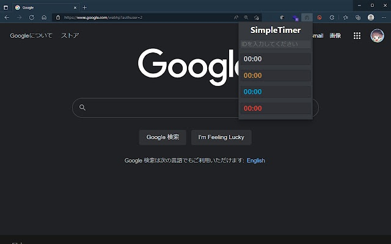

# ブラウザ拡張機能
ブラウザに拡張機能を入れることで、ブラウザ上でタイマーの時間を確認することができます。

<procedure title="対応ブラウザ">
<list>
<li>Microsoft Edge</li>
<li>Google Chrome</li>
<li>Mozilla Firefox</li>
</list>
</procedure>

<procedure title="導入方法">

<procedure title="Chromeのウェブストアから 対象ブラウザ：Edge・Chrome"  collapsible="true">
<list type="decimal" start="1">
<li><a href="https://chromestore.ext.simpletimer.dev">ChromeウェブストアのSimpleTimer-Extensionsのページ</a>に移動します。</li>
<li>青色のChromeに追加ボタンを押します。</li>
</list>
</procedure>

<procedure title="FirefoxBrowserADD-ONSから 対象ブラウザ：Firefox"  collapsible="true">
<list type="decimal" start="1">
<li><a href="https://mozilla.ext.simpletimer.dev">FirefoxBrowserADD-ONSのSimpleTimer-Extensionsのページ</a>に移動します。</li>
<li>青色のFirefoxに追加ボタンを押します</li>
</list>
</procedure>

<procedure title="GitHubから手動で導入" collapsible="true">

手動による導入はGitHubにて紹介しています。

<deflist>
    <def title="JanMaki/SimpleTimer-Extensions">
        <a href="https://source.ext.simpletimer.dev">https://source.ext.simpletimer.dev</a>
    </def>
</deflist>
</procedure>

</procedure>

<procedure title="使用方法">
<list type="decimal" start="1">
<li>タイマーを動かすチェンネルで<a href="cmd_extension.md">/extension</a>を実行し、ID（数字の羅列）を取得した。</li>
<li>ブラウザに導入されているSimpleTimer-Extensionsのアイコンをクリックする。</li>
<li>開いたメニューの上にあるIDの入力欄に取得したIDを手に入れる。</li>
<li>タイマーがチャンネルで動いていると、タイマーの内容がメニューから確認できます。</li>
</list>
</procedure>

<procedure title="誤差が大きい時の対処法">

以下の2点を確認してください。

<procedure title="タイムゾーンを確認する" collapsible="true">
<procedure title="Windowsをお使いの場合" collapsible="true">
<list type="decimal" start="1">
<li>設定を開く。</li>
<li> 左のメニューより時刻と言語を選び、日付と時刻をクリックする。</li>
<li>タイムゾーンを(UTC+09:00)大阪、札幌、東京にする。</li>
</list>
</procedure>
<procedure title="Macをお使いの場合" collapsible="true">

Appleの公式のユーザーガイドを参照して設定し、 時間帯のタブの下部の時間帯が日本標準時になっているかを確認してください。

<deflist>
    <def title="Appleの公式のユーザーガイド">
        <a href="https://support.apple.com/ja-jp/guide/mac-help/mchlp2996/mac">Macで日付と時刻を自動的に設定する</a>
    </def>
</deflist>
</procedure>

</procedure>

<procedure title="タイムゾーンを確認する" collapsible="true">

<procedure title="Windowsをお使いの場合" collapsible="true">
<list type="decimal" start="1">
<li>設定を開く。</li>
<li>左のメニューより時刻と言語を選び、日付と時刻をクリックする。</li>
<li>少し下にある今すぐ同期を押す。</li>
</list>
</procedure>
<procedure title="Macをお使いの場合" collapsible="true">
<list type="decimal" start="1">
<li>トップ画面左上🍎マークを押してシステム環境設定…をクリックする。</li>
<li>日付と時刻を開く</li>
<li>日付と時刻を自動的に設定の中の文字列を確認する。</li>
<li>もし中がない時は、time.google.comを設定する。</li>
<li>ターミナルアプリを開く。</li>
<li>sudo sntp -sS {address}を実行する。</li>
</list>
<tip>
    

        {address}の部分は3か4で確認した文字列かに変更してください。
    

</tip>
</procedure>
</procedure>
</procedure>